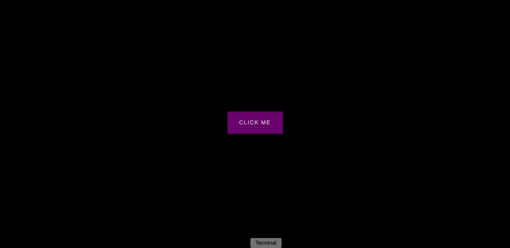

## Project Title

Button Ripple Effect

## Purpose

As a new developer, I want to do a daily coding project tutorial to learn new features and deepen my understanding of Web Development.

## Description

A button that has a ripple effect when clicked. But the ripple is generated from the position on the button that's clicked rather than from the center.

## Demo

https://curtiskil.github.io/button-ripple-effect/

## Contributors

Brad Traversy. Florin Pop.
